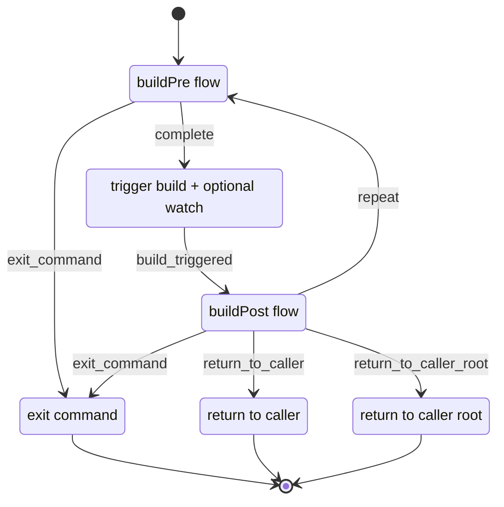
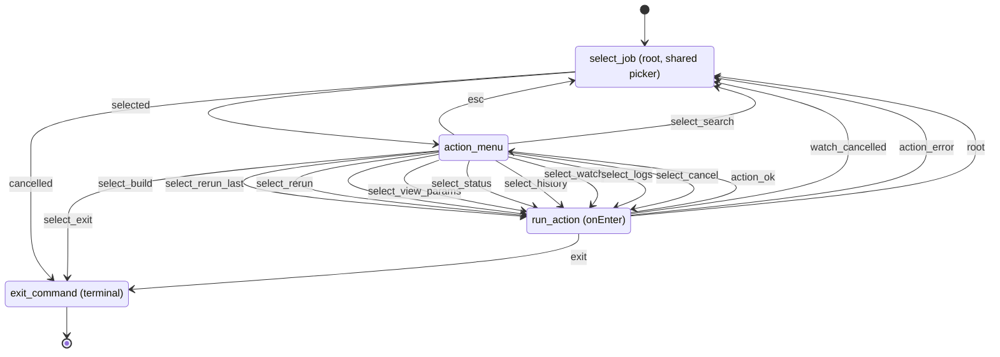
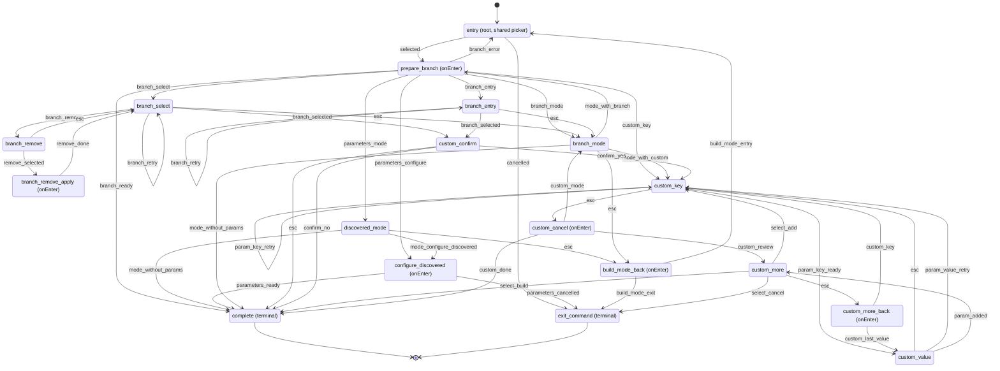
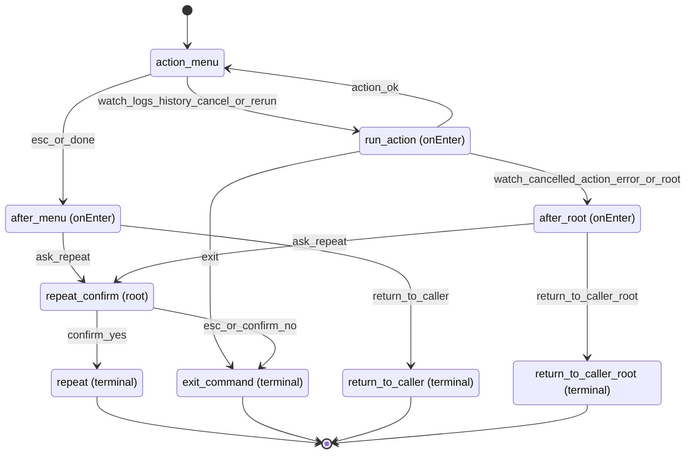
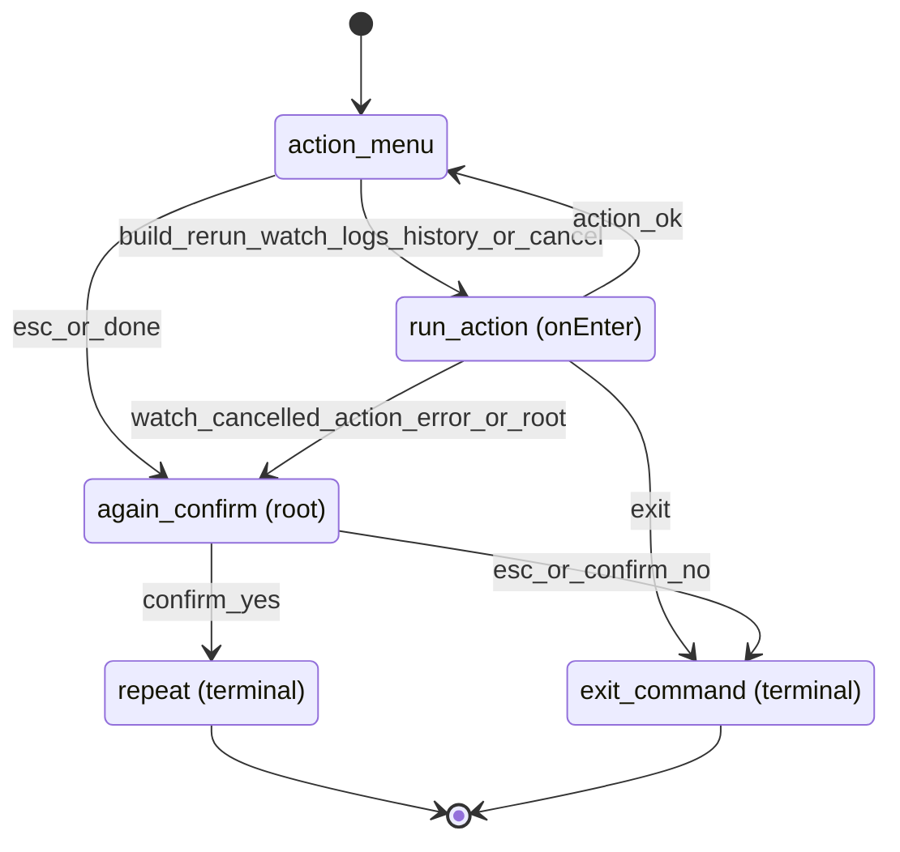

# TUI State Diagrams

These diagrams summarize the interactive state machines declared in
`src/flows/definition.ts`. Handler-specific conditions live in
`src/flows/handlers.ts`.

Event labels use underscores in place of colons because Mermaid state diagrams
do not reliably parse colons in transition labels. Prompt cancellation is
shown as `esc`; picker handlers use the semantic event `cancelled`.

## Build command orchestration

## `listInteractive`

## `buildPre`

The `entry` state delegates job selection to the shared picker. Parameter
discovery then chooses between Jenkins defaults, discovered parameter prompts,
branch selection, or custom parameters.

## `buildPost`

## `statusPost`

